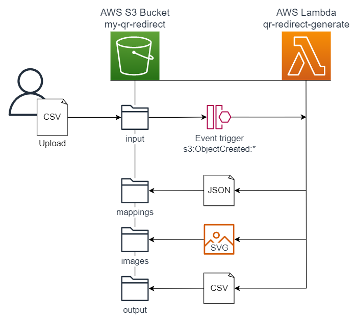
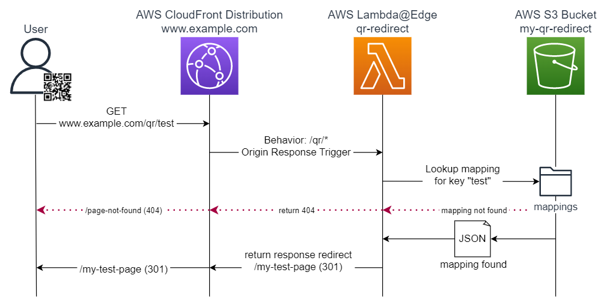

# serverless-qr-redirect
Serverless lambda functions for generating QR codes and handling redirects with CloudFront and S3.

# QR Redirect Generator
This serverless project creates an S3 bucket with a trigger to a Lambda function responsible for generating QR codes and their associated rediects.  

For mor information, [visit the function folder](functions/qr-redirect-generate)  

# QR Redirect
This serverless project creates a Lambda@Edge function for a CloudFront origin response to handle redirects.  

For mor information, [visit the function folder](functions/qr-redirect)  

&nbsp;